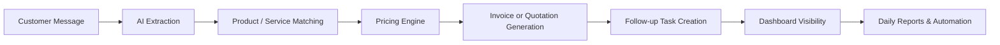

# WhatsApp-to-Invoice AI Workflow System


An AI-powered operations assistant for SMEs that transforms customer conversations into structured business workflows.

The system extracts customer requests, identifies products or services, calculates pricing, generates invoices or quotations, creates follow-up tasks, and provides automated reporting.

<p align="center">
  
</p>

<p align="center">
  
</p>


# Problem

Many small businesses receive customer requests through WhatsApp-like channels but still manually:

- Read and understand customer messages
- Identify requested products or services
- Prepare quotations
- Calculate prices
- Create invoices
- Assign follow-up tasks
- Prepare daily operational reports

This creates delays, repetitive work, and inconsistent processes.

# Solution

This project introduces an AI workflow layer that converts unstructured customer conversations into structured business operations.

The system acts as a lightweight AI business assistant that connects customer communication with internal operations.

# Workflow Overview



# Key Capabilities

## AI Message Understanding

- Extracts customer intent from messages
- Identifies products or services
- Extracts dates, locations, quantities, and missing information
- Supports replaceable AI provider architecture

## Business Workflow Automation

- Matches requests against product/service catalogs
- Calculates:
  - Subtotal
  - Delivery fees
  - Tax placeholders
  - Final totals
- Creates draft orders
- Generates invoices or quotations
- Creates internal follow-up tasks automatically

## Operations Dashboard

- Product-style operator interface
- Workflow visibility
- Order tracking
- Reporting support

## Automation

- Daily report generation
- SMTP email dispatch
- n8n automation integration
- Protected automation endpoints


# Supported Business Use Cases

The workflow core supports multiple SME scenarios:

### Pharmacy Orders

Customer request → product matching → pricing → invoice workflow

### Cleaning Services

Customer requirements → quotation generation → follow-up task creation

### Maintenance Services

Service request → information extraction → operational workflow

These scenarios are implemented as domain-specific behavior on top of a shared workflow engine.


# Architecture

## Backend

- FastAPI API framework
- SQLAlchemy ORM
- SQLite database for local/demo usage
- Jinja2 invoice template rendering
- Pydantic settings management

## Frontend

- HTML/CSS/JavaScript operator console
- Served directly through FastAPI
- Optional Streamlit dashboard for internal demonstrations

## Automation Layer

- n8n workflow integration
- SMTP email reporting
- Automation-ready API endpoints

## Testing

- pytest automated test suite


# Main Interfaces

## Operator Interface

```
GET /ui
```

## API Endpoints

```
GET  /health

POST /messages/extract

POST /orders/from-message

POST /reports/generate

POST /reports/send

POST /automation/daily-report
```

## API Documentation

```
GET /docs
```


# Project Structure

```
app/
 ├── api/routes/
 ├── ai/providers/
 ├── core/
 ├── models/
 ├── repositories/
 ├── schemas/
 ├── services/
 └── templates/

dashboard/

data/

frontend/

n8n/

tests/
```


# Local Installation

## 1. Create Environment

```powershell
conda create -n env-workflow python=3.11 -y

conda activate env-workflow

pip install -r requirements.txt
```


## 2. Configure Environment Variables

```powershell
Copy-Item .env.example .env
```

Update `.env`:

```
API_KEY=
N8N_WEBHOOK_SECRET=
SMTP settings
```


## 3. Start Application

```powershell
python -m uvicorn app.main:app --host 0.0.0.0 --port 8000 --reload
```


## 4. Open Operator UI

```
http://127.0.0.1:8000/ui
```


## 5. Optional Dashboard

```powershell
python -m streamlit run dashboard\streamlit_app.py
```


# Docker Deployment

Build image:

```powershell
docker build -t whatsapp-to-invoice-ai .
```

Run:

```powershell
docker run --rm -p 8000:8000 --env-file .env whatsapp-to-invoice-ai
```

The Docker setup is optimized for API and product UI serving.

For persistent database storage:

```powershell
docker run --rm \
-p 8000:8000 \
--env-file .env \
-v ${PWD}\runtime:/runtime \
whatsapp-to-invoice-ai
```

Database configuration:

```
DATABASE_URL=sqlite:////runtime/sme_ai_workflow.db
```


# n8n Integration

n8n is used as the orchestration layer while business logic remains inside the application.

Recommended workflow:

```
n8n Schedule Trigger

        ↓

HTTP Request

        ↓

POST /automation/daily-report

        ↓

Daily Report Processing
```

Reference files:

```
n8n/README.md

n8n/workflow_examples/daily-report-trigger.json
```


# Test Suite

Run tests:

```powershell
python -m pytest -q
```

Verified coverage includes:

- Health endpoint
- Database models
- AI extraction workflow
- Catalog matching
- Pricing engine
- Order creation
- Invoice workflow
- Task generation
- Dashboard access
- Report generation
- Automation routes
- Product UI routes


# Product Positioning

This project demonstrates a production-oriented AI workflow architecture designed for SME automation.

It can be used as:

- AI automation portfolio project
- Freelance demonstration system
- Backend engineering case study
- SME workflow automation foundation
- Lightweight VPS deployment solution


# Production Readiness

Implemented:

✅ AI workflow ingestion  
✅ Message extraction  
✅ Product/service matching  
✅ Pricing engine  
✅ Invoice and quotation workflow  
✅ Follow-up task automation  
✅ Operator UI  
✅ Daily reporting  
✅ n8n-ready automation  
✅ Docker packaging  
✅ Automated testing  


Future Improvements:

- User authentication and role management
- PostgreSQL production deployment
- PDF invoice generation
- Background job processing
- Advanced analytics dashboard
- Production secrets management
- Cloud deployment configuration


# Recommended Roadmap

1. Add authentication and multi-company support

2. Move database layer to PostgreSQL

3. Add WhatsApp Business API integration

4. Add PDF invoice generation

5. Deploy using Docker Compose on a VPS

6. Add analytics and customer behavior insights
